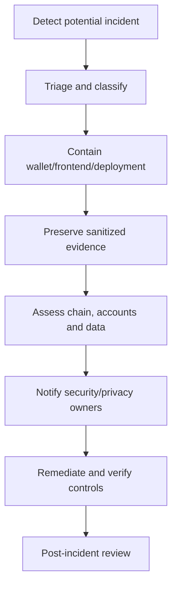

# 🚨 Incident response workflow

```mermaid
flowchart TD
    DETECT["Detect potential incident"] --> TRIAGE["Triage and classify"]
    TRIAGE --> CONTAIN["Contain wallet/frontend/deployment"]
    CONTAIN --> EVIDENCE["Preserve sanitized evidence"]
    EVIDENCE --> IMPACT["Assess chain, accounts and data"]
    IMPACT --> ESCALATE["Notify security/privacy owners"]
    ESCALATE --> FIX["Remediate and verify controls"]
    FIX --> REVIEW["Post-incident review"]
```

For a public-chain clinical data disclosure, do not promise deletion. On-chain data cannot be reliably removed.
